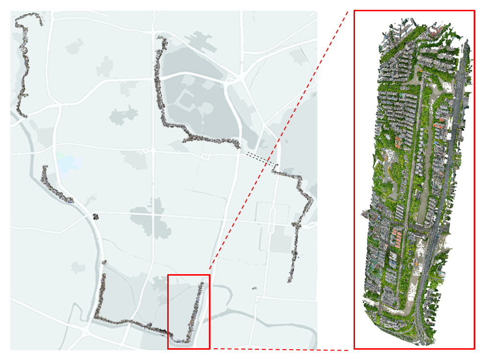
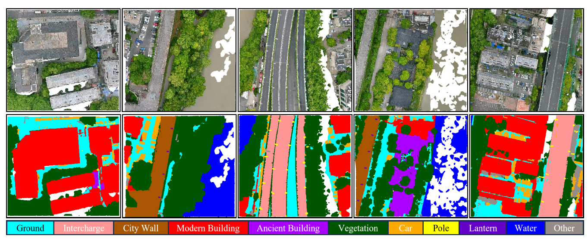
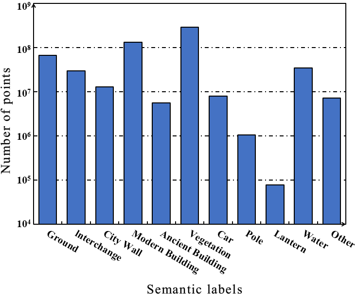

# CityWall3D：用于城市遗产环境语义分割的大规模点云数据集

这是**CityWall3D**数据集的官方库。详情请参考: 
**CityWall3D: A Large-Scale Point Cloud Dataset for Semantic Segmentation of Urban Heritage Environments**  
Tengping Jiang, Shiwei Li, Qinyu Zhang, Guangshuai Wang, Zequn Zhang, Fankun Zeng, Peng An, Xin Jin, Shan Liu, Yongjun Wang. 

城市遗产环境三维点云背景下的细粒度场景理解具有巨大的经济价值，但由于缺乏合适的特定数据集，其发展受到严重限制。此外，大多数在现有城市点云数据集上训练的工作对遗产数据的泛化能力较差，因为不重叠的特殊和罕见类别（如城墙和古建筑）造成了很大的领域差距。为了发挥监督深度学习模型在3D城市遗产理解中的潜力，本文提出了一种新的具有大规模丰富的注释点的点云基准，称为CityWall3D。具体而言，CityWall3D是第一个用于语义分割的特定于遗产的3D数据集。它通过地面激光扫描（TLS）和无人机（UAV）摄影测量获取，覆盖了南京城墙及全长约22公里的周边区域，其6亿个点被精细标记为11类。实验结果表明，CityWall3D有效地代表了真实的城市遗产环境，并在点云的跨域、类不平衡和密度不均匀性方面提出了挑战。

## 样例

## 下载
如果您想申请该数据集，请按以下格式填写信息，并通过电子邮件发送至 221302150@njnu.edu.cn 或 231312003@njnu.edu.cn。我们会尽快给您回复。  
  
	主题：请求提供 CityWall3D 数据集  
 
    ******** 基本信息 ********
    · 姓名:
    · 电子邮件:
    · 所属单位:
    · 联系电话:
    
    ******** 研究背景 ********
    · 研究领域/方向:
    · 您计划如何使用数据集？（例如学术研究、商务分析、课程项目等）：:
    · 您是否愿意在您的研究成果中引用或参考该数据集及其来源:
    · 您对该数据集的建议（可选）:
    
## 数据集

### 总览

CityWall3D 包含约22公里的南京城墙，以及两侧50米范围内的周边区域，总面积约3.6平方公里，标记点云数量约6亿。为了更好地组织和读取点云，我们根据同质性原理将标记的点云划分为18个区块，每个区块占地约346000m²。

  

图 1. CityWall3D 数据集覆盖区域概览。
 

### 数据收集

为了有效地表现真实的城市遗产环境，我们采集了几乎完整的南京城墙遗产环境本体。由于城墙外观复杂，且存在扫描盲区，因此采用TLS和无人机摄影测量相结合的方法进行采集。TLS的采集主要涉及汉中门、东水关、神策门等城墙的重点段，尤其是其独特的女嫱和雉堞建筑，具有巨大的遗产价值。更具体地说，我们使用了配备尼康D810单反数码相机的RIEGL VZ-400i扫描系统。无人机摄影测量主要收集城墙的普通段以及周边区域，它们构成了数据集的大部分。我们采用了DJI Phantom 4 RTK无人机，该无人机搭载了2000万有效像素的摄像头。在飞行过程中，无人机保持在城墙上方约100米的高度，并沿着弯曲的轨迹飞行。同时，相机保持垂直拍摄模式，并根据一定的重叠（航向方向约70%，旁向方向约60%）拍摄彩色图像。

### 语义标注

  

图 2. CityWall3D 数据集示例。不同的语义类别用不同的颜色标注。
 

- **地面**（不透水表面和崎岖地形）
- **立交桥**（高架立交和三叶立交）
- **城墙**（遗产城墙）
- **现代建筑**（住宅、高层建筑和仓库）
- **古建筑**（古代遗产建筑）
- **植被**（树木、灌木、树篱和灌木）
- **车**（轿车、卡车和公共汽车）
- **杆**（电线杆和灯杆）
- **灯笼**（城墙上的古风路灯）
- **水系**（河流和水渠）
- **其他**（剩余对象）

### 数据统计

  

图 3. CityWall3D 数据集中不同语义类别的分布情况。
 

## 更新日历

## 相关库
1. [KPConv: Flexible and deformable convolution for point clouds](https://github.com/HuguesTHOMAS/KPConv) 
2. [RandLA-Net: Efficient Semantic Segmentation of Large-Scale Point Clouds](https://github.com/QingyongHu/RandLA-Net) 
3. [SCF-Net: Learning Spatial Contextual Features for Large-Scale Point Cloud Segmentation](https://github.com/leofansq/SCF-Net) 
4. [Push-the-Boundary: Boundary-aware Feature Propogation for Semantic Segmentation of 3D Point Clouds](https://github.com/shenglandu/PushBoundary) 
5. [SQN: Weakly-Supervised Semantic Segmentation of Large-Scale 3D Point Clouds](https://github.com/QingyongHu/SQN) 
6. [All Points Matter: Entropy-Regularized Distribution Alignment for Weakly-supervised 3D Segmentation](https://github.com/LiyaoTang/ERDA) 
7. [PointCT: Point Central Transformer Network for Weakly-supervised Point Cloud Semantic Segmentation](https://github.com/anhthuan1999/PointCT) 
