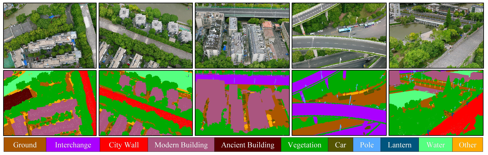

# CityWall3D: A Large-Scale Point Cloud Dataset for Semantic Segmentation of Urban Heritage Environments

This is the official repository of the **CityWall3D** dataset. For details, please refer to: 
**CityWall3D: A Large-Scale Point Cloud Dataset for Semantic Segmentation of Urban Heritage Environments**  
Lin Zhao, Chaodong Ma, Xin Xu, Qinyu Zhang, Tengping Jiang, Yongjun Wang. 

## Abstract
Fine-grained scene understanding in the context of 3D point clouds for urban heritage environment carries enormous economic values, but its development is severely limited by the lack of suitable and specific datasets. Besides, most of the work trained on existing urban point cloud datasets exhibit poor generalization on heritage data because of a large domain gap caused by non-overlapped special and rare categories, e.g., city walls and ancient buildings. To release the potential of supervised deep learning models in 3D urban heritage understanding, we present a new point cloud benchmark, dubbed CityWall3D, with large-scale richly annotated points. Specifically, CityWall3D is the first heritage-specific 3D dataset for semantic segmentation. It covers a total length of approximately 22 kilometers of the Nanjing City Wall and its surroundings, acquired by Terrestrial Laser Scanning (TLS) and Unmanned Aerial Vehicle (UAV) photogrammetry, with 0.6 billion points finely labeled into 11 classes. The experimental results indicate that CityWall3D effectively represents real urban heritage environments, and poses challenges in terms of cross domain, class imbalance and density inhomogeneity of point clouds.

## Demo

## Download
If you would like to apply for this dataset, please complete the information in the following format and email it to 221302150@njnu.edu.cn or 231312003@njnu.edu.cn. We'll get right back to you.  
  
	Subject: Request for CityWall3D dataset 
 
    ******** Basic information ********
    · Name:
    · Email Address:
    · Affiliation/Unit:
    · Contact Phone Number:
    
    ******* Research background *******
    · Research area/direction:
    · How do you plan to use the dataset? (e.g. academic research, business analysis, curriculum projects, etc.):
    · Would you be willing to cite or refer to this dataset and its sources in your research results:
    · Your suggestions for this dataset(Optional):

## Dataset

### Overview

CityWall3D contains about 22km of the Nanjing City Wall, as well as the environment within a range of 50m on both sides, with a total area about 3.6km², and the number of labeled point clouds is around 0.6 billion. For a better organization and reading of the point cloud, we divide the labeled point cloud into 18 blocks according to the homogeneity principle, each block covers about 346,000m².

  

Figure 1. Overview of the coverage area of CityWall3D dataset.
 

### Data Collection

To effectively represent the real urban heritage environment, we captured the nearly intact ontology of the Nanjing City Wall heritage environment. Due to the complicated appearance of the city wall and the existence of scanning blind zones, CityWall3D is acquired by a combination of TLS and UAV photogrammetry.

The TLS acquisition mainly concerns the critical sections of the city wall, such as Hanzhong Gate, Dongshuiguan, and Shence Gate, especially their unique battlement and merlon construction, which are of immense heritage value. More specifically, we utilized a RIEGL VZ-400i scanning system equipped with a Nikon D810 SLR digital camera.

The UAV photogrammetry primarily collects the ordinary sections of the city wall as well as the surroundings, which make up the majority of the dataset. We adopted the DJI Phantom 4 RTK UAV carrying a camera with 20 million effective pixels. During the flight, the UAV was kept at a height of about 100m over the city wall and flew along a curved trajectory. At the same time, the camera maintained a vertical shooting mode and took color images according to a certain overlap (about 70% in the heading direction and 60% in the side direction).

### Semantic Annotations

  

Figure 2. Examples of our CityWall3D dataset. Different semantic classes are labeled by different colors.
 

- **Ground** (impervious surfaces and rough terrain)
- **lnterchange** (elevated interchange and cloverleaf interchange)
- **City Wall** (heritage city walls)
- **Modern Building** (residential, high-rises, and warehouses)
- **Ancient Building** (ancient style heritage buildings)
- **Vegetation** (trees, shrubs, hedges, and bushes)
- **Car** (cars, trucks, and buses)
- **Pole** (power line poles and light poles)
- **Lantern** (ancient style lights on the city wall)
- **Water** (rivers and water canals)
- **Other** (remaining objects)

### Statistics

  

Figure 3. The distribution of different semantic labels in the CityWall3D dataset.
 

## Updates

## Related Repos
1. [KPConv: Flexible and deformable convolution for point clouds](https://github.com/HuguesTHOMAS/KPConv) 
2. [RandLA-Net: Efficient Semantic Segmentation of Large-Scale Point Clouds](https://github.com/QingyongHu/RandLA-Net) 
3. [SCF-Net: Learning Spatial Contextual Features for Large-Scale Point Cloud Segmentation](https://github.com/leofansq/SCF-Net) 
4. [Push-the-Boundary: Boundary-aware Feature Propogation for Semantic Segmentation of 3D Point Clouds](https://github.com/shenglandu/PushBoundary) 
5. [SQN: Weakly-Supervised Semantic Segmentation of Large-Scale 3D Point Clouds](https://github.com/QingyongHu/SQN) 
6. [All Points Matter: Entropy-Regularized Distribution Alignment for Weakly-supervised 3D Segmentation](https://github.com/LiyaoTang/ERDA) 
7. [PointCT: Point Central Transformer Network for Weakly-supervised Point Cloud Semantic Segmentation](https://github.com/anhthuan1999/PointCT) 
